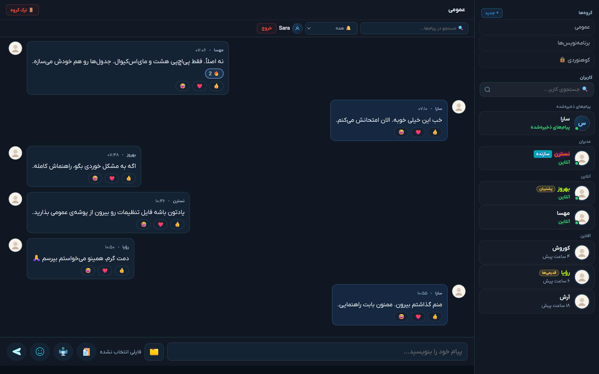
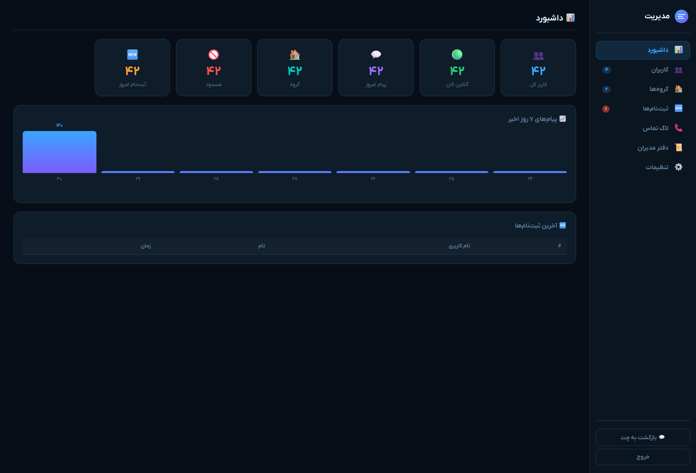
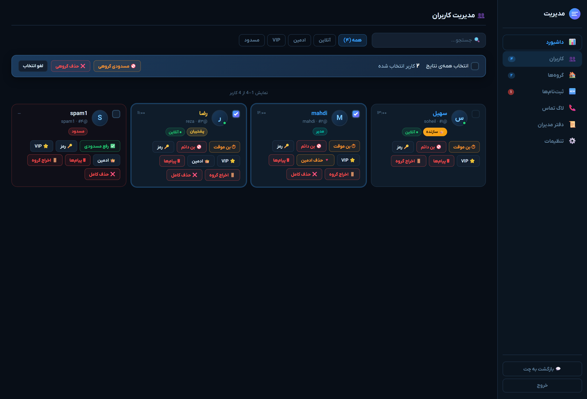
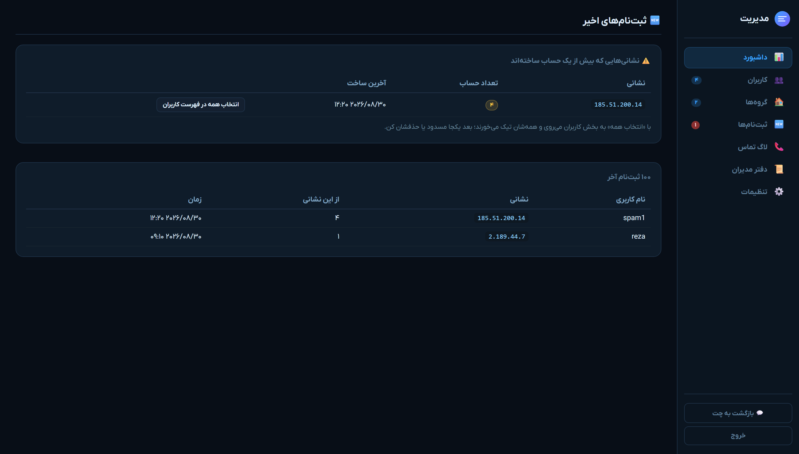
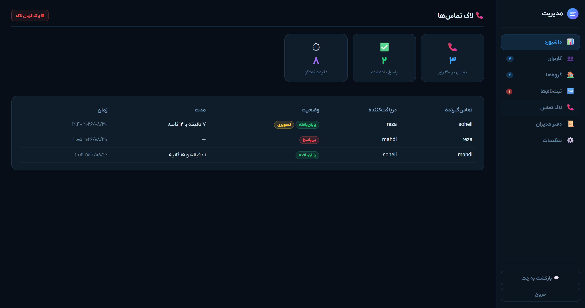
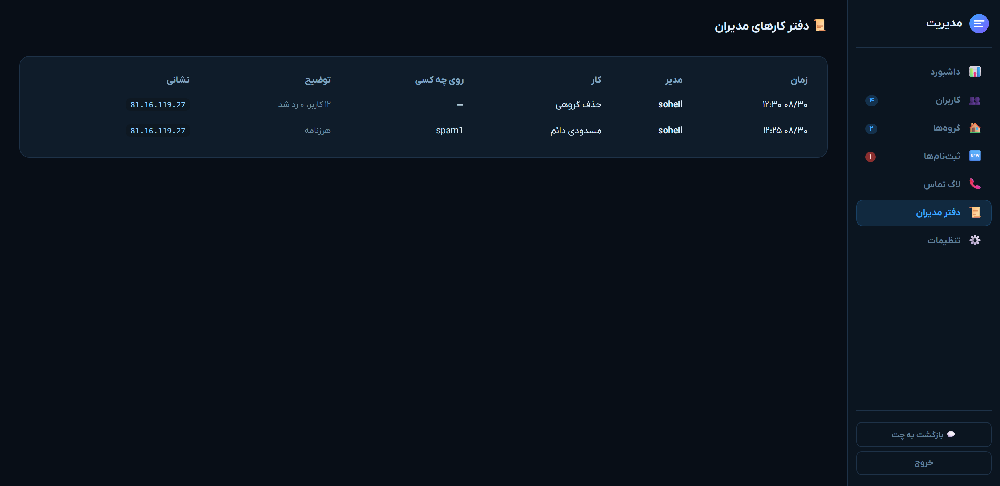
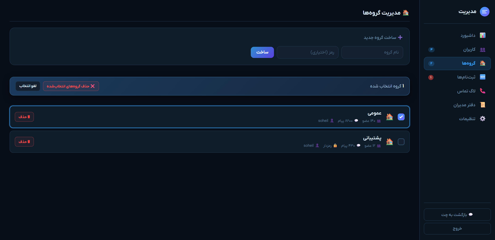
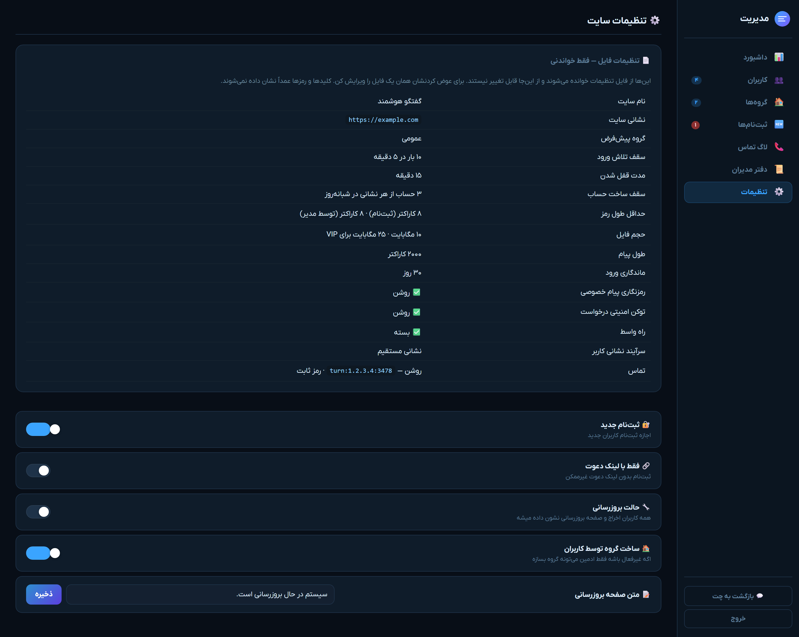
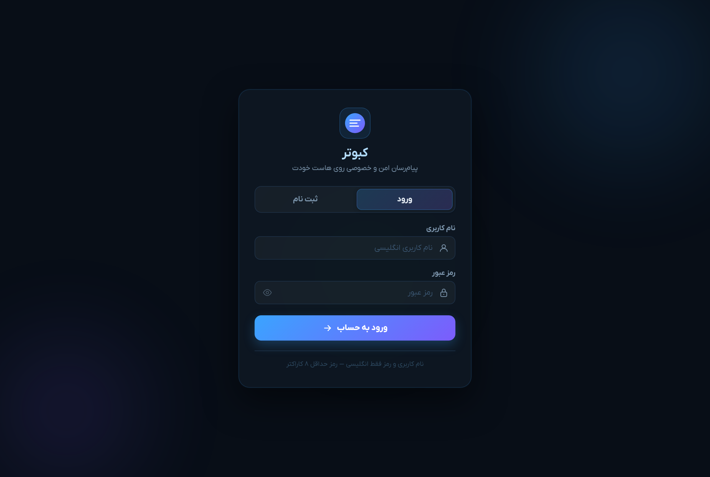

<div align="center">

# 🕊️ کبوتر

**پیام‌رسان تحت وب فارسی — روی هاست اشتراکی خودت**

چت روم، پیام خصوصی، تماس صوتی و تصویری، پنل مدیریت. تماماً راست‌چین و فارسی.
یک پوشه را آپلود می‌کنی و کار می‌کند — بدون سرور اختصاصی، بدون داکر، بدون دسترسی ریشه.

[](https://php.net)
[](https://mysql.com)
[](LICENSE)
[](#)



</div>

<div dir="rtl" align="right">

## 💡 این چیست

**کبوتر** یک پیام‌رسان تحت وب است که روی **هاست اشتراکی معمولی** — همان هاست‌های سی‌پنل و دایرکت‌ادمین — اجرا می‌شود.

اگر دنبال یکی از این‌ها می‌گردی، این پروژه همان است:

- **چت روم فارسی** برای سایت یا جمع خودت
- **پیام‌رسان خصوصی** که داده‌اش روی سرور خودت بماند، نه سرور یک شرکت دیگر
- **اسکریپت چت پی‌اچ‌پی** آماده و راست‌چین، بدون نصب پیچیده
- جایگزین خودمیزبان برای پیام‌رسان‌های تجاری

بدون نودجی‌اس، بدون وب‌سوکت، بدون ردیس، بدون کارگر پس‌زمینه. فقط **پی‌اچ‌پی و مای‌اس‌کیوال**. جدول‌ها را خودش می‌سازد.

</div>

<div dir="rtl" align="right">

## ✨ امکانات

### 💬 گفتگو

فضای گفتگوی کامل، با هر چیزی که از یک پیام‌رسان انتظار داری.

| امکان | توضیح |
|:--|:--|
| **گروه‌های عمومی و خصوصی** | هر گروه می‌تواند رمز داشته باشد، یا فقط با لینک دعوت باز شود |
| **پیام خصوصی دو نفره** | با سازوکار درخواست و پذیرش — کسی نمی‌تواند بدون اجازه به تو پیام بدهد |
| **پاسخ و نقل‌قول** | روی هر پیامی جواب بده؛ پیام اصلی بالای جوابت نشان داده می‌شود |
| **هدایت پیام** | پیام را به گروه یا شخص دیگری بفرست |
| **ویرایش و حذف** | پیام فرستاده‌شده را اصلاح کن یا بردار |
| **سنجاق کردن** | پیام مهم را بالای گروه بچسبان تا همه ببینند |
| **واکنش با شکلک** | به‌جای جواب دادن، فقط واکنش بگذار |
| **جستجو در پیام‌ها** | داخل هر گفتگو دنبال متن بگرد |
| **در حال نوشتن** | ببین طرف مقابل دارد تایپ می‌کند |
| **وضعیت آنلاین** | چه کسی الان هست، چه کسی چند ساعت پیش بوده |
| **نشان خوانده‌شدن** | بفهم پیامت دیده شده یا نه |
| **حالت آهسته** | در گروه شلوغ، فاصله‌ی اجباری بین پیام‌ها بگذار |

### 📎 فایل و رسانه

| امکان | توضیح |
|:--|:--|
| **ارسال فایل** | تصویر، صدا، سند و بایگانی — با سقف حجم جداگانه برای کاربر عادی و ویژه |
| **بررسی نوع واقعی فایل** | فقط به پسوند اعتماد نمی‌شود؛ محتوای فایل هم بررسی می‌شود |
| **پیام صوتی** | مستقیم از داخل مرورگر ضبط کن و بفرست |
| **تصویر نمایه** | هر کاربر تصویر خودش را آپلود می‌کند |
| **نگهداری امن** | فایل‌ها با نام تصادفی و بدون پسوند ذخیره می‌شوند و از راه وب مستقیماً باز نمی‌شوند |

### 📞 تماس

| امکان | توضیح |
|:--|:--|
| **تماس صوتی و تصویری** | دو نفره، روی وب‌آرتی‌سی — صدا و تصویر مستقیم بین دو مرورگر رد و بدل می‌شود |
| **تاریخچه‌ی تماس** | چه کسی، با چه کسی، چه مدت، با چه سرانجامی |
| **رمز موقت** | برای سرور ترن، به‌جای رمز ثابتی که در مرورگر همه می‌نشیند |

### 🛡️ پنل مدیریت

| امکان | توضیح |
|:--|:--|
| **داشبورد** | تعداد کاربر، آنلاین، پیام امروز، و نمودار هفت روز گذشته |
| **اقدام گروهی** | ده‌ها حساب را با تیک زدن انتخاب کن و یکجا مسدود یا حذف کن — دیگر لازم نیست دانه‌دانه پاک کنی |
| **دیده‌بان ثبت‌نام** | ثبت‌نام‌های اخیر همراه نشانی شبکه، با هشدار روی نشانی‌هایی که چند حساب ساخته‌اند و دکمه‌ی «همه‌شان را انتخاب کن» |
| **دفتر مدیران** | هر کار مدیریتی ثبت می‌شود: چه کسی، چه کاری، روی چه کسی، از کجا |
| **سه سطح دسترسی** | کاربر، مدیر، سازنده — مدیر نمی‌تواند روی مدیر هم‌رده یا بالاتر از خودش دست بگذارد |
| **مدیریت کاربر** | نشان ویژه، مسدودی موقت و دائم، تغییر رمز، اخراج از گروه‌ها، حذف کامل |
| **مدیریت گروه** | ساخت، رمزگذاری، حالت آهسته، نقش‌ها، حذف گروهی |
| **حالت بروزرسانی** | سایت را موقتاً ببند بدون اینکه چیزی خراب شود |
| **تنظیمات فایل** | ببین چه چیزی در فایل تنظیمات است و از پنل قابل تغییر نیست |

### 📱 دیگر

| امکان | توضیح |
|:--|:--|
| **نصب روی گوشی** | مثل یک برنامه‌ی واقعی به صفحه‌ی اصلی اضافه می‌شود |
| **اعلان** | حتی وقتی صفحه باز نیست |
| **ماندگاری ورود** | لازم نیست هر بار وارد شوی |
| **راست‌چین کامل** | همه‌چیز، از چیدمان تا ارقام فارسی |
| **قلم آزاد** | با وزیرمتن می‌آید؛ اگر پروانه‌ی ایران‌یکان را داری، فقط فایل‌هایش را بگذار |

</div>

<div dir="rtl" align="right">

## 🖼️ تصاویر

روی هر عنوان کلیک کن تا تصویرش باز شود.

<details>
<summary><b>📊 پنل مدیریت — داشبورد</b></summary>

<div align="center">



</div>

</details>

<details>
<summary><b>👥 مدیریت کاربران — با انتخاب گروهی</b></summary>

<div align="center">



</div>

</details>

<details>
<summary><b>🆕 دیده‌بان ثبت‌نام</b></summary>

<div align="center">



</div>

</details>

<details>
<summary><b>📞 تاریخچه‌ی تماس</b></summary>

<div align="center">



</div>

</details>

<details>
<summary><b>📜 دفتر کارهای مدیران</b></summary>

<div align="center">



</div>

</details>

<details>
<summary><b>🏠 مدیریت گروه‌ها</b></summary>

<div align="center">



</div>

</details>

<details>
<summary><b>⚙️ تنظیمات</b></summary>

<div align="center">



</div>

</details>

<details>
<summary><b>🔑 صفحه‌ی ورود</b></summary>

<div align="center">



</div>

</details>

## 🚀 نصب

### پیش‌نیاز

پی‌اچ‌پی ۸٫۰ یا بالاتر · مای‌اس‌کیوال ۵٫۷ به بالا یا ماریادی‌بی ۱۰٫۳ به بالا

افزونه‌های لازم: `pdo_mysql` · `openssl` · `mbstring` · `fileinfo`

همه‌ی این‌ها روی هر هاست اشتراکی معمولی از قبل هست.

### گام به گام

**۱.** فایل‌ها را در پوشه‌ی عمومی سایت آپلود کن (`public_html` یا `www`).

**۲.** یک پایگاه داده‌ی مای‌اس‌کیوال بساز و کاربرش را به آن وصل کن.

**۳.** فایل `config.sample.php` را به `config.local.php` کپی کن و مشخصات پایگاه داده را بگذار:

</div>

```php
'db' => [
    'host' => 'localhost',
    'name' => 'نام پایگاه داده',
    'user' => 'نام کاربر',
    'pass' => 'رمز',
],
```

<div dir="rtl" align="right">

**۴.** یک کلید رمزنگاری تصادفی بساز و در همان فایل بگذار:

</div>

```php
'security' => [
    'msg_encrypt_key' => 'یک-رشته-تصادفی-۳۲-کاراکتری',
],
```

<div dir="rtl" align="right">

> ⚠️ **این کلید را بعد از اولین پیام هرگز عوض نکن.** پیام‌های خصوصی با همین کلید رمزگذاری می‌شوند و با کلید جدید ناخوانا می‌شوند.

**۵.** سایت را باز کن. هجده جدول و ستون‌هایشان خودکار ساخته می‌شوند — لازم نیست هیچ فایل اس‌کیو‌ال وارد کنی.

**۶.** ثبت‌نام کن. **اولین حسابی که ساخته می‌شود، خودکار سازنده است** و به `admin.php` دسترسی دارد.

</div>

<div dir="rtl" align="right">

> ⚠️ به همین دلیل، بلافاصله بعد از نصب ثبت‌نام کن. اگر سایت را رها کنی، اولین غریبه‌ای که نشانی را پیدا کند سازنده می‌شود.

تمام. اگر بعداً خواستی کس دیگری را سازنده کنی:

</div>

```sql
UPDATE users SET is_admin = 1, admin_level = 2 WHERE username = 'نام کاربری او';
```

<div dir="rtl" align="right">

### اگر خطای اتصال به پایگاه داده گرفتی

صفحه‌ای که نشان داده می‌شود خودش می‌گوید مشکل کجاست. رایج‌ترین‌ها:

| پیام | یعنی چه |
|:--|:--|
| کاربر دسترسی ندارد | کاربر ساخته شده ولی به پایگاه داده وصل نشده. در پنل هاست وصلش کن و همه‌ی دسترسی‌ها را بده |
| نام کاربری یا رمز اشتباه | مقدار `user` و `pass` را با پنل هاست مقایسه کن |
| پایگاه داده پیدا نشد | نام را بررسی کن — بعضی پنل‌ها پیشوند اضافه می‌کنند |
| سرور در دسترس نیست | `host` را بررسی کن، معمولاً `localhost` درست است |

برای دیدن متن کامل خطا، موقتاً در فایل تنظیمات `'debug' => true` بگذار. **روی سایت زنده حتماً به `false` برگردان** — در حالت روشن، مسیر سرور و نام کاربر پایگاه داده در صفحه‌ی خطا دیده می‌شود.

### کجا فایل تنظیمات را بگذارم

برنامه دو جا را به این ترتیب می‌گردد:

**۱. یک پله بیرون از پوشه‌ی عمومی** با نام `chat-config.php` — امن‌ترین حالت، چون اصلاً از راه وب قابل درخواست نیست.

**۲. کنار `config.php`** با نام `config.local.php` — فایل `.htaccess` جلوی خوانده شدنش را می‌گیرد.

اگر هاستت اجازه‌ی نوشتن بیرون از پوشه‌ی عمومی می‌دهد، گزینه‌ی اول را انتخاب کن.

## ⚙️ تنظیمات

**همه‌چیز در یک فایل جمع است.** برای هیچ تغییری لازم نیست به کد دست بزنی.

| بخش | چه چیزی را تعیین می‌کند |
|:--|:--|
| `site` | نام سایت، شعار، نشانی، رنگ، نام گروه پیش‌فرض |
| `db` | اتصال پایگاه داده |
| `security` | کلید رمزنگاری، توکن امنیتی، مدت ماندگاری ورود، سرآیند نشانی واقعی کاربر |
| `limits` | سقف تلاش ورود، سقف ساخت حساب از هر نشانی، حداقل طول رمز، حجم فایل، طول پیام |
| `calls` | سرور استان و ترن برای تماس صوتی و تصویری |
| `features` | روشن و خاموش کردن تماس و ثبت‌نام |

چند مورد — باز بودن ثبت‌نام، حالت بروزرسانی، ثبت‌نام فقط با دعوت — از خود پنل مدیریت هم قابل تغییرند و در پایگاه داده ذخیره می‌شوند.

## 📞 راه‌اندازی تماس صوتی و تصویری

تماس روی **وب‌آرتی‌سی** کار می‌کند: صدا و تصویر مستقیم بین دو مرورگر رد و بدل می‌شود و از سرور تو رد نمی‌شود. ولی برای اینکه دو مرورگر همدیگر را پیدا کنند، دو چیز لازم است.

**سرور استان** نشانی عمومی هر طرف را پیدا می‌کند. نمونه‌ی رایگان گوگل در تنظیمات پیش‌فرض هست و برای بیشتر شبکه‌ها کافیست.

**سرور ترن** برای وقتی دو طرف پشت مودم یا شبکه‌ی بسته‌اند و مستقیم به هم نمی‌رسند. این را باید خودت روی یک سرور نصب کنی:

</div>

```bash
apt install coturn
```

<div dir="rtl" align="right">

بعد در `/etc/turnserver.conf`:

</div>

```ini
listening-port=3478
realm=example.com
use-auth-secret
static-auth-secret=یک-رشته-تصادفی-بلند
```

<div dir="rtl" align="right">

و همان رشته را در فایل تنظیمات بگذار:

</div>

```php
'calls' => [
    'turn_url'    => 'turn:نشانی-سرورت:3478',
    'turn_secret' => 'همان-رشته',
],
```

<div dir="rtl" align="right">

با این روش برای هر کاربر یک **رمز یک‌بارمصرف** ساخته می‌شود که بعد از یک ساعت منقضی می‌شود، و رمز اصلی هرگز از سرور بیرون نمی‌رود.

اگر ترنت رمز ثابت دارد، به‌جایش `turn_user` و `turn_pass` را پر کن. ساده‌تر است ولی ضعیف‌تر، چون رمز به مرورگر همه‌ی کاربران می‌رسد.

> 🔒 تنظیمات سرور تماس هرگز نباید در فایل‌های جاوااسکریپت نوشته شود — آن فایل‌ها بدون ورود قابل خواندنند. کبوتر این تنظیمات را از `api/ice.php` می‌دهد که ورود لازم دارد.

## 🔐 امنیت

| موضوع | چه کاری انجام شده |
|:--|:--|
| **رمز کاربران** | با `password_hash` نگهداری می‌شود، هرگز به شکل خام |
| **تزریق پایگاه داده** | همه‌ی پرس‌وجوها با دستور آماده — ورودی کاربر هیچ‌وقت به دستور چسبانده نمی‌شود |
| **جعل درخواست** | توکن امنیتی روی همه‌ی درخواست‌های نوشتن |
| **حمله‌ی رمز** | سقف تلاش ورود، ماندگار در پایگاه داده و گره‌خورده به نشانی کاربر — با پاک کردن کوکی دور زده نمی‌شود |
| **ساخت انبوه حساب** | سقف روزانه از هر نشانی، به‌علاوه‌ی دیده‌بان ثبت‌نام در پنل |
| **بالا رفتن سطح دسترسی** | مدیر نمی‌تواند رمز مدیر هم‌رده یا سازنده را عوض کند یا کسی را مدیر کند |
| **ردیابی** | هر کار مدیریتی در دفتر ثبت می‌شود |
| **فایل‌های آپلودی** | نام تصادفی بدون پسوند، اجرای کد در پوشه‌شان خاموش، دسترسی مستقیم بسته |
| **پیام خصوصی** | رمزگذاری‌شده در پایگاه داده می‌نشیند |
| **رازها** | بیرون از پوشه‌ی عمومی، خارج از مخزن |

### اگر روی هاست اشتراکی هستی

- فایل تنظیمات را **بیرون** از پوشه‌ی عمومی بگذار
- **هیچ‌وقت** پشتیبان یا فایل فشرده‌ی سورس را داخل پوشه‌ی عمومی نگذار — هر کسی می‌تواند دانلودش کند
- اگر سایتت پشت واسط یا شبکه‌ی توزیع محتواست، `client_ip_header` را تنظیم کن، وگرنه سقف‌ها روی نشانی واسط اعمال می‌شوند نه کاربر واقعی

## 📁 ساختار پروژه

</div>

```
config.php              راه‌انداز — خواندن تنظیمات، نشست، بارگذاری کتابخانه‌ها
config.sample.php       نمونه‌ی فایل تنظیمات (کپی کن به config.local.php)

lib/
  helpers.php           پایگاه داده، کاربر جاری، فایل، رمزنگاری
  security.php          سقف‌ها، سطح دسترسی، توکن، دفتر ثبت
  schema.php            ساختار جدول‌ها

api/
  messages.php          ارسال، خواندن، ویرایش، جستجو
  rooms.php             گروه‌ها، عضویت، نقش‌ها
  users.php             فهرست کاربران
  call.php              سیگنال‌دهی تماس
  ice.php               تنظیمات سرور تماس (ورود لازم)
  admin_action.php      کارهای مدیریتی
  ...

assets/                 ظاهر، اسکریپت، قلم، شکلک
storage/uploads/        فایل‌های کاربران — از راه وب بسته

index.php               ورود و ثبت‌نام
chat.php                صفحه‌ی گفتگو
admin.php               پنل مدیریت
manifest.php            فهرست نصب روی گوشی
```

<div dir="rtl" align="right">

### تغییر ساختار جدول‌ها

`lib/schema.php` ساختار را نگه می‌دارد و **فقط وقتی اجرا می‌شود که `SCHEMA_VERSION` عوض شده باشد**. اگر ستون یا جدولی اضافه کردی، آن عدد را یکی زیاد کن.

## ❓ پرسش‌های پرتکرار

**روی هاست اشتراکی کار می‌کند؟**
بله، دقیقاً برای همین ساخته شده. نه به دسترسی ریشه نیاز دارد، نه به نصب چیزی روی سرور.

**وب‌سوکت لازم دارد؟**
نه. از نظرخواهی دوره‌ای استفاده می‌کند که روی هر هاستی کار می‌کند.

**تماس صوتی بدون سرور ترن کار می‌کند؟**
گاهی. اگر هر دو طرف شبکه‌ی بازی داشته باشند بله، ولی برای اطمینان سرور ترن لازم است.

**داده‌ها کجا می‌مانند؟**
روی هاست خودت. هیچ چیزی به بیرون فرستاده نمی‌شود.

**چند کاربر را تحمل می‌کند؟**
روی یک هاست اشتراکی معمولی، چند صد کاربر ثبت‌نام‌شده و چند ده نفر همزمان آنلاین بدون مشکل.

**می‌توانم نام و ظاهرش را عوض کنم؟**
بله. نام، شعار و رنگ در فایل تنظیمات است. قلم را هم می‌توانی عوض کنی.

## 🤝 مشارکت

کبوتر **متن‌باز** است. یعنی کد کاملاً در اختیار توست و لازم نیست منتظر کسی بمانی.

**باگی دیدی؟** خودت درستش کن. کد را باز کن، اگر بلد نیستی از یک دستیار هوش مصنوعی کمک بگیر — فایل‌ها کوچک و کامنت‌گذاری‌شده‌اند و ساختار پروژه ساده است. بعد پول‌ریکوئست بفرست تا برای بقیه هم درست شود.

**امکانی می‌خواهی؟** همین‌طور. اضافه‌اش کن و بفرست.

**نمی‌خواهی خودت دست بزنی؟** ایشو باز کن و بگو چه دیدی — چه اتفاقی افتاد، انتظار داشتی چه بشود، و روی چه هاستی.

هر پول‌ریکوئستی که کد را ساده‌تر یا امن‌تر کند، پذیرفته می‌شود.

## 📄 پروانه

[MIT](LICENSE) — آزادانه استفاده کن، تغییر بده، بفروش، منتشر کن. فقط نام پدیدآورنده را نگه دار.

قلم **وزیرمتن** پروانه‌ی جدای خودش را دارد: [SIL Open Font License](assets/fonts/Vazirmatn/OFL.txt)

</div>

---

<div align="center" dir="ltr">

<sub>

<b>Kabutar</b> — a Persian (Farsi) RTL web messenger for shared hosting.

Group chat, private messages, WebRTC voice &amp; video calls, admin panel.

PHP + MySQL only — no Node, no WebSocket, no Docker, no root access.

A self-hosted alternative to commercial chat services.

</sub>

`persian chat` · `farsi messenger` · `rtl chat` · `php chat script`

`self-hosted chat` · `shared hosting` · `webrtc` · `chat room`

</div>
